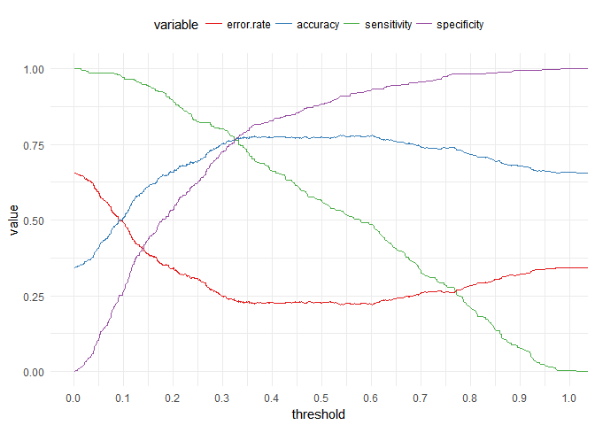
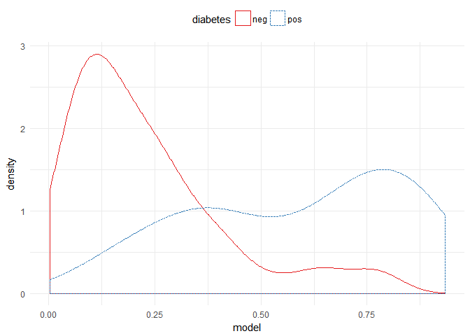

Machine Learning (Classification) with R
================

### Using Logistic Regression algorithm to classify diabetec and non-diabetec patients based on some analysis results...

first we import the libraries prepare the data and look at it.

``` r
# load needed libraries
suppressMessages(library(ggplot2))
suppressMessages(library(corrplot))
suppressMessages(library(mlbench))
suppressMessages(library(caret))
suppressMessages(library(reshape2))
suppressMessages(library(dplyr))
suppressMessages(library(ROCR))
```

``` r
data("PimaIndiansDiabetes")
head(PimaIndiansDiabetes)
```

    ##   pregnant glucose pressure triceps insulin mass pedigree age diabetes
    ## 1        6     148       72      35       0 33.6    0.627  50      pos
    ## 2        1      85       66      29       0 26.6    0.351  31      neg
    ## 3        8     183       64       0       0 23.3    0.672  32      pos
    ## 4        1      89       66      23      94 28.1    0.167  21      neg
    ## 5        0     137       40      35     168 43.1    2.288  33      pos
    ## 6        5     116       74       0       0 25.6    0.201  30      neg

``` r
str(PimaIndiansDiabetes)
```

    ## 'data.frame':    768 obs. of  9 variables:
    ##  $ pregnant: num  6 1 8 1 0 5 3 10 2 8 ...
    ##  $ glucose : num  148 85 183 89 137 116 78 115 197 125 ...
    ##  $ pressure: num  72 66 64 66 40 74 50 0 70 96 ...
    ##  $ triceps : num  35 29 0 23 35 0 32 0 45 0 ...
    ##  $ insulin : num  0 0 0 94 168 0 88 0 543 0 ...
    ##  $ mass    : num  33.6 26.6 23.3 28.1 43.1 25.6 31 35.3 30.5 0 ...
    ##  $ pedigree: num  0.627 0.351 0.672 0.167 2.288 ...
    ##  $ age     : num  50 31 32 21 33 30 26 29 53 54 ...
    ##  $ diabetes: Factor w/ 2 levels "neg","pos": 2 1 2 1 2 1 2 1 2 2 ...

``` r
with(PimaIndiansDiabetes, table(diabetes))
```

    ## diabetes
    ## neg pos 
    ## 500 268

The data has 9 variables, one we want to predict and 8 others. the data is cleaned and prepared, so we won't spend too much time in this step, we can move forward to variable selection.

##### which variables of the 8 variables should we select?!

there're many methods for variable selection and we're going to look at three of them here; first we can look at the variables distribution visually with mapping to the outcome to see which variables indvidually can discern between the outcome results.

``` r
melted <- melt(PimaIndiansDiabetes, id.var = 'diabetes')
ggplot(melted, aes(x = value, color = diabetes, linetype = diabetes)) +
  geom_density() + facet_wrap(~ variable, scales = 'free')
```


Here we can see that **"pregnant"**, **"glucose"**, **"mass"** and somehow **"age"** variables each have a threshold in which we can identify whether the patient has diabetes or not. so these are the values we can use.

another way is to look at the correlation coefficients between the outcome and each values.

``` r
cor_mat <- cor(
  within(PimaIndiansDiabetes, 
         diabetes <- as.numeric(diabetes))) %>%
  round(digits = 2)
corrplot(cor_mat, method = 'number',
         tl.srt = 45, tl.col = 'black')
```


Almost the same variables show the highest correlations coefficients with the diabetes variable, so this confirms that these are the variables to use.

The third way is to apply the regression model on all the variables and look at its summary to exclude variables with **insignificant p-value**.

``` r
glm_all <- glm(diabetes ~ ., data = PimaIndiansDiabetes,
    family = binomial(link = 'logit'))
summary(glm_all)
```

    ## 
    ## Call:
    ## glm(formula = diabetes ~ ., family = binomial(link = "logit"), 
    ##     data = PimaIndiansDiabetes)
    ## 
    ## Deviance Residuals: 
    ##     Min       1Q   Median       3Q      Max  
    ## -2.5566  -0.7274  -0.4159   0.7267   2.9297  
    ## 
    ## Coefficients:
    ##               Estimate Std. Error z value Pr(>|z|)    
    ## (Intercept) -8.4046964  0.7166359 -11.728  < 2e-16 ***
    ## pregnant     0.1231823  0.0320776   3.840 0.000123 ***
    ## glucose      0.0351637  0.0037087   9.481  < 2e-16 ***
    ## pressure    -0.0132955  0.0052336  -2.540 0.011072 *  
    ## triceps      0.0006190  0.0068994   0.090 0.928515    
    ## insulin     -0.0011917  0.0009012  -1.322 0.186065    
    ## mass         0.0897010  0.0150876   5.945 2.76e-09 ***
    ## pedigree     0.9451797  0.2991475   3.160 0.001580 ** 
    ## age          0.0148690  0.0093348   1.593 0.111192    
    ## ---
    ## Signif. codes:  0 '***' 0.001 '**' 0.01 '*' 0.05 '.' 0.1 ' ' 1
    ## 
    ## (Dispersion parameter for binomial family taken to be 1)
    ## 
    ##     Null deviance: 993.48  on 767  degrees of freedom
    ## Residual deviance: 723.45  on 759  degrees of freedom
    ## AIC: 741.45
    ## 
    ## Number of Fisher Scoring iterations: 5

``` r
## use of varImp function from caret to inspect the important variables
varImp(glm_all)
```

    ##            Overall
    ## pregnant 3.8401403
    ## glucose  9.4813935
    ## pressure 2.5404160
    ## triceps  0.0897131
    ## insulin  1.3223094
    ## mass     5.9453340
    ## pedigree 3.1595780
    ## age      1.5928584

this method introduced two more variables **"pressure"** and **"pedigree"** and excluded the *"age"* variable.

These are three methods to select variables to use in the model and they all almost said the same; that **"pregnant"**, **"glucose"** and **"mass"** variables are the most important ones to use and one or two are also important depending on the method we'll stick with. Here I will go with the **"p-value"** method ...

So let's get down to business. First we'll define the auc function to evaluate the model, then we split the data into training and test then we apply the model.

``` r
auc <- function(model, outcome) { 
  per <- performance(prediction(model, outcome == 'pos'),
                     "auc")
  as.numeric(per@y.values)
}

set.seed(13)
PimaIndiansDiabetes$split <- runif(nrow(PimaIndiansDiabetes))
training <- subset(PimaIndiansDiabetes, split <= 0.9)
test <- subset(PimaIndiansDiabetes, split > 0.9)
vars <- c('pregnant', 'glucose', 'pressure', 'mass', 'pedigree')

glm_model <- glm(diabetes ~ ., 
                 data = training[, c('diabetes', vars)],
                 family = binomial(link = 'logit')
                   )
summary(glm_model)
```

    ## 
    ## Call:
    ## glm(formula = diabetes ~ ., family = binomial(link = "logit"), 
    ##     data = training[, c("diabetes", vars)])
    ## 
    ## Deviance Residuals: 
    ##     Min       1Q   Median       3Q      Max  
    ## -2.7142  -0.7466  -0.4321   0.7275   2.9001  
    ## 
    ## Coefficients:
    ##              Estimate Std. Error z value Pr(>|z|)    
    ## (Intercept) -7.718002   0.708037 -10.901  < 2e-16 ***
    ## pregnant     0.149042   0.029582   5.038 4.70e-07 ***
    ## glucose      0.033314   0.003517   9.473  < 2e-16 ***
    ## pressure    -0.013821   0.005395  -2.562   0.0104 *  
    ## mass         0.087712   0.015117   5.802 6.54e-09 ***
    ## pedigree     0.843829   0.310661   2.716   0.0066 ** 
    ## ---
    ## Signif. codes:  0 '***' 0.001 '**' 0.01 '*' 0.05 '.' 0.1 ' ' 1
    ## 
    ## (Dispersion parameter for binomial family taken to be 1)
    ## 
    ##     Null deviance: 883.11  on 685  degrees of freedom
    ## Residual deviance: 656.34  on 680  degrees of freedom
    ## AIC: 668.34
    ## 
    ## Number of Fisher Scoring iterations: 5

Here we can see that all the variables have significant p-value so that's cool.

Next we need to see how the model can separate the training data it's already seen. We'll plot a density plot using the probabilities the model gives mapping the color to the outcome to see at which probability value the model can easily separate and differentiate the outcome, i.e **Threshold**.

``` r
training$model <- predict(glm_model, training[, c('diabetes', vars)],
                          type = 'response')
ggplot(training, aes(x = model, color = diabetes, 
                     linetype = diabetes)) +
  geom_density() 
```


It seems that there is a threshold but we cannot spot at what probability exactly, so we will plot different parameters to get the best threshold value. we will plot **Specificity**, **Sensitivity**, **Accuracy** and **Error Rate**.

``` r
pred_object <- prediction(training$model, training$diabetes)
perf_object <- performance(pred_object, "sens", "spec")
sensitivity <- perf_object@y.values[[1]]
specificity <- perf_object@x.values[[1]]
acc <- performance(pred_object, "acc")
accuracy <- acc@y.values[[1]]
error.rate <- 1 - accuracy
threshold <- acc@x.values[[1]]
errors <- data.frame(cbind(threshold, 
                           cbind(error.rate, 
                                 cbind(accuracy, 
                                       cbind(sensitivity, specificity)))))

error.data <- melt(errors, id.vars = "threshold")
ggplot(error.data, aes(x = threshold, y = value, 
                       col = variable)) + 
  geom_line() + scale_x_continuous(breaks = seq(0.0, 1, 0.1))
```



##### Here we can see that the best probability value to use is **0.32**.

let's inspect this measuring both accuracy and auc of the model.

``` r
with(training, mean(diabetes == ifelse(
  model >= 0.32, 'pos', 'neg'
)))
```

    ## [1] 0.7638484

``` r
auc(training$model, training$diabetes)
```

    ## [1] 0.8322411

The model seems to give nice results, but this is on the training data so we have to check its performance on the test data to be able to generalize the model on data it hasn't seen.

``` r
test$model <- predict(glm_model, test[, c('diabetes', vars)],
                      type = 'response')
ggplot(test, aes(x = model, color = diabetes, 
                     linetype = diabetes)) +
  geom_density() 
```



``` r
with(test, mean(diabetes == ifelse(
  model >= 0.32, 'pos', 'neg'
)))
```

    ## [1] 0.804878

``` r
auc(test$model, test$diabetes)
```

    ## [1] 0.87

Our model gives even better results on test data. So we can confidently generalize our model.

Hope this helped to have an idea how to do classification tasks using R ...
